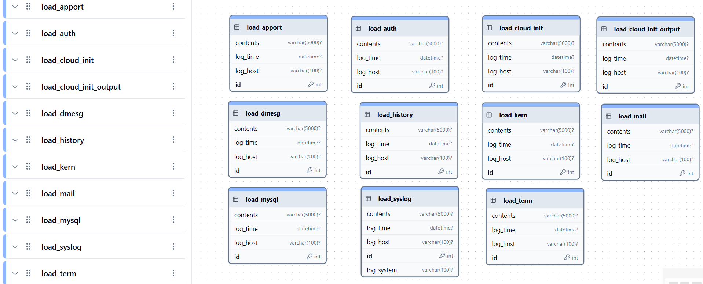

## MySQL or MariaDB | Linux-based system log files | LOAD DATA tables

Now Python re-write and SQL has separate repository there is another database I've been building.

Additional sub-processes can be added to files-to-mysql import process.
Database schema 7 day snapshot designed for system logs for Linux-based servers. This retention time is adjustable. 

Same Typescript Node.js Web interface works on BOTH http and system logs.

# Database designed for Linux-based system log data analysis

## Visual Interface App
in my development queue is [mysql-to-echarts](https://github.com/willthefarmer/mysql-to-echarts) a Web interface for the database schema in Typescript.

[mysql-to-echarts](https://github.com/willthefarmer/mysql-to-echarts) is a ***visualization tool*** built with [Express](https://github.com/expressjs/express) web application frameworks and [W2UI](https://github.com/vitmalina/w2ui) drill-down data grids for ***data point details*** while [Apache ECharts](https://github.com/apache/echarts) frameworks is for Data Visualization.

## Other Documents
[Installation Instructions](INSTALL.md)

[Support Information](SUPPORT.md)

[Change Log](CHANGELOG.md)
